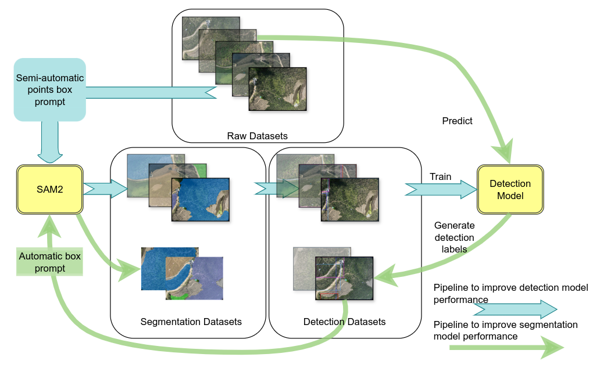

# Iterative Optimization Annotation Pipeline and ALSS-YOLO-Seg for Efficient Banana Plantation Segmentation in UAV Imagery 
📝 [paper](https://www.frontiersin.org/journals/plant-science/articles/10.3389/fpls.2024.1508549/abstract)
🤗 [实验结果](https://github.com/helloworlder8/computer_vision/tree/24-09-20)
## 引用

```
@article{he15iterative,
  title={Iterative Optimization Annotation Pipeline and ALSS-YOLO-Seg for Efficient Banana Plantation Segmentation in UAV Imagery},
  author={He, Ang and Wu, Ximei and Xu, Xing and Chen, Jing and Guo, Xiaobin and Xu, Sheng},
  journal={Frontiers in Plant Science},
  volume={15},
  pages={1508549},
  publisher={Frontiers}
}
```

[模型整体配置](../ultralytics/cfg_yaml/models/ALSS-YOLO-seg/ALSS-YOLO-seg.yaml)

## 主要创新点汇总


### 迭代优化的标注工作流
<h3 align="center">
    <a></a>
</h3>

### MSCA模块
```python
class MSCAMv3(nn.Module):
    def __init__(self, c1, c_=4):
        super(MSCAMv3, self).__init__()
        self.c_ = c_
        self.cardinality = 4
        
        self.channel_reduction = nn.Conv2d(c1, c_, kernel_size=3, bias=False)
        
        self.conv1 = nn.Conv2d(c_, c_, kernel_size=1, groups=c_, bias=False)
        self.pool1 = nn.AdaptiveAvgPool2d(1)
        self.conv2 = nn.Conv2d(c_, c_, kernel_size=3, groups=c_, bias=False)
        self.pool2 = nn.AdaptiveAvgPool2d(3)
        self.conv3 = nn.Conv2d(c_, c_, kernel_size=3, groups=c_, bias=False)
        self.pool3 = nn.AdaptiveAvgPool2d(3)
        self.conv4 = nn.Conv2d(c_, c_, kernel_size=5, groups=c_, bias=False)
        self.pool4 = nn.AdaptiveAvgPool2d(5)
        
        self.channel_expansion = nn.Conv2d(c_ * self.cardinality, c1, kernel_size=1, bias=False)
        self.act = nn.SiLU()
        self.Sig = nn.Sigmoid()

    def forward(self, x):
        y = self.act(self.channel_reduction(x))

        y1 = self.pool1(y)
        y1 = self.conv1(y1)
        # y1 = self.act(y1)

        y2 = self.pool2(y)
        y2 = self.conv2(y2)
        # y2 = self.act(y2)

        y3 = self.pool3(y)
        y3 = self.conv3(y3)
        # y3 = self.act(y3)
        
        y4 = self.pool4(y)
        y4 = self.conv4(y4)
        # y4 = self.act(y4)

        y_concat = torch.cat([y1, y2, y3, y4], dim=1)
        
        y = self.Sig(self.channel_expansion(y_concat))
        y = y.expand_as(x)
        return x * y
```
