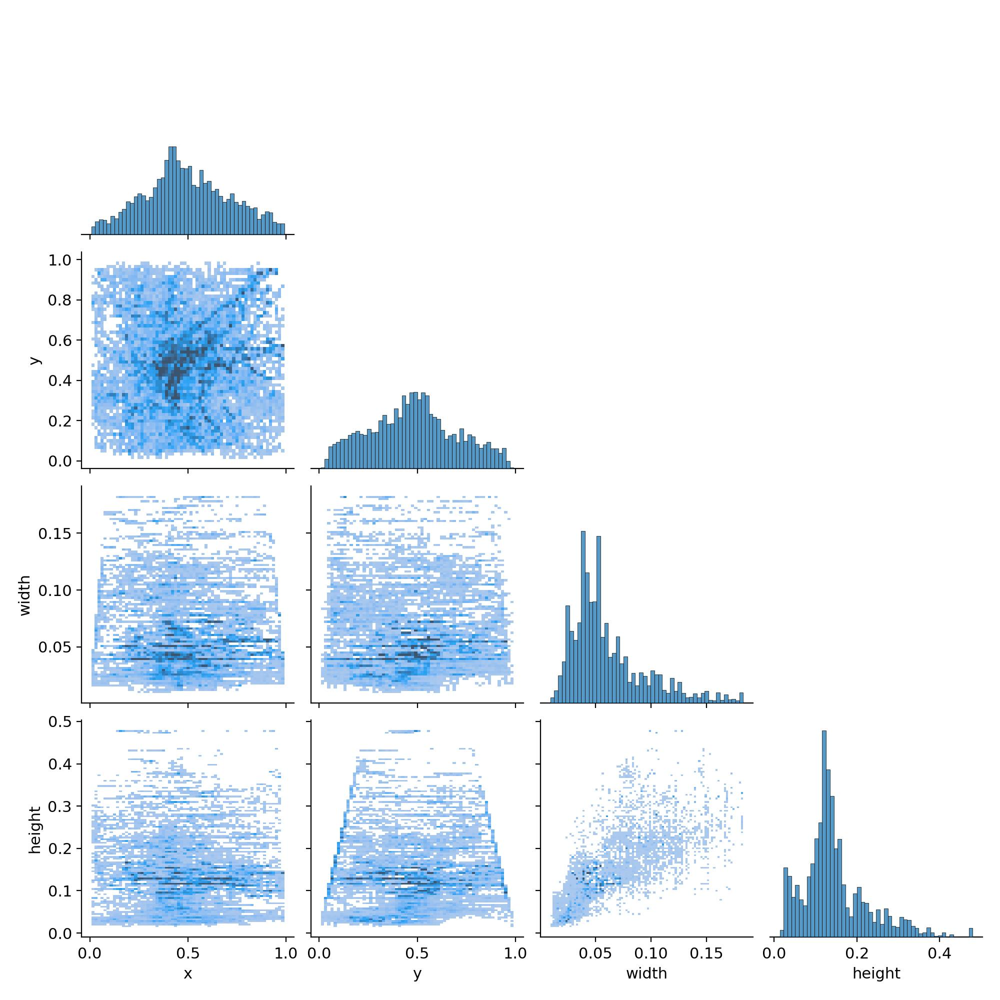
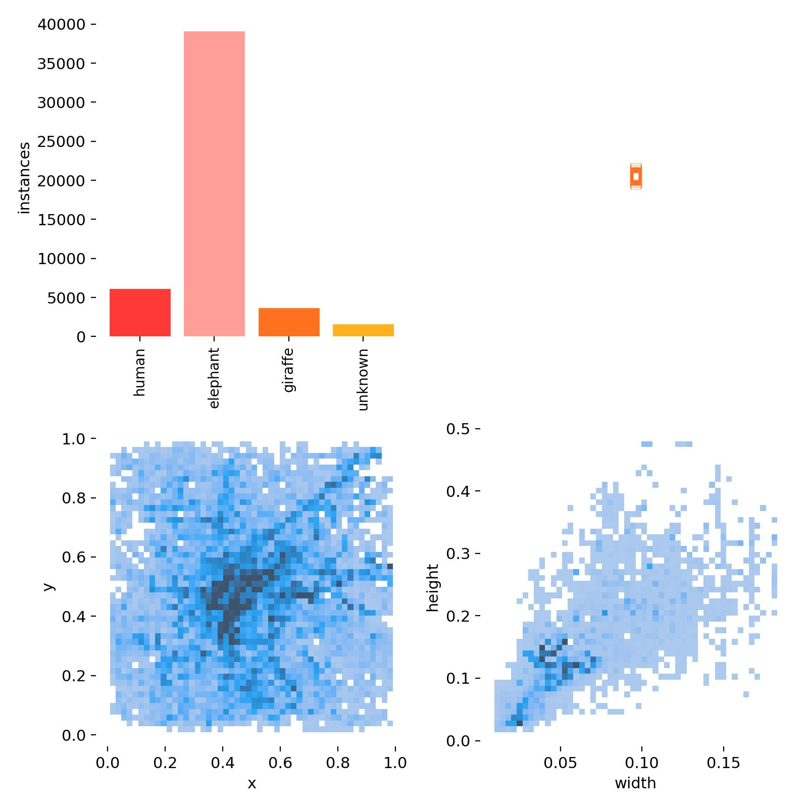
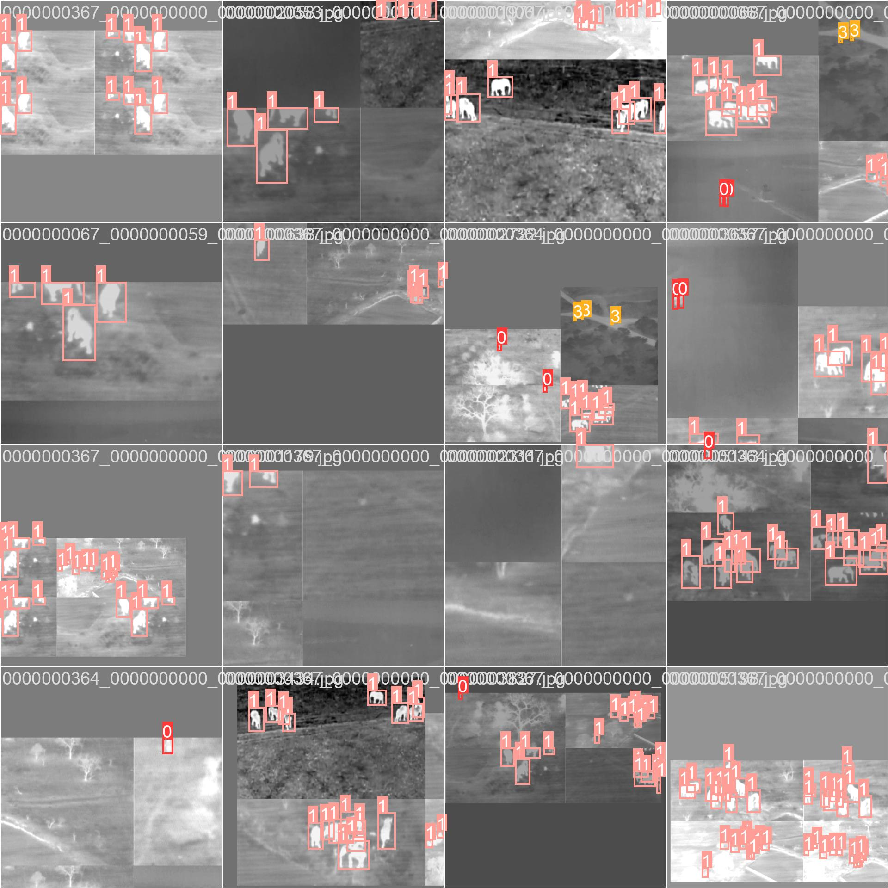

画图
labels_correlogram.jpg  labels.jpg
`self.plot_training_labels()`



`self.plot_training_samples(batch, ni)`


打印
```python
self.pbar.set_description(  # 打印
    ("%11s" * 2 + "%11.4g" * (2 + loss_len))
    % (f"{self.current_epoch + 1}/{self.total_epochs}", mem, *avg_loss_items, batch["cls"].shape[0], batch["img"].shape[-1])
)
```


```python
bar = TQDM(self.dataloader, desc=self.get_desc(), total=len(self.dataloader))
```